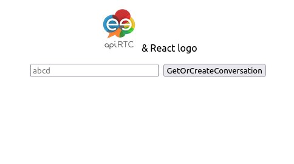

# ApiRTC over ReactJS

## Description
This project is a very simple **WebRTC** application developped in **ReactJS** and using **ApiRTC**. 

It is running **live** hosted on github.io : https://apirtc.github.io/apirtc-react/.


## How to run this example
1. Clone the git repository on your computer
```
git clone git@github.com:ApiRTC/apirtc-react.git
```
2. Navigate into the app folder
```
cd apirtc-react
```
3. Install the node modules

```
npm install
```
4. Start the app. It will spin a local node server. 

```
npm start
```
5. Open 2 tabs in your browser at http://localhost:3000/apirtc-react


6. Type the same conversation name in the input box then click on the button. 
   
7. Happy! You should see yourself (twice) with an echoing sound (sometime going mad in feedback)

# Want to know more about ApiRTC?
Go to the [developer portal](https://dev.apirtc.com/)